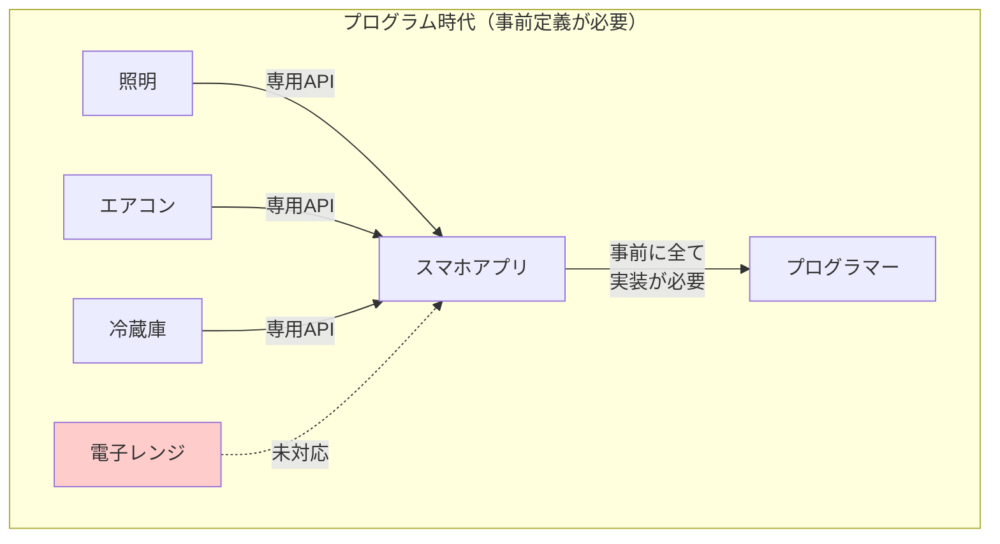
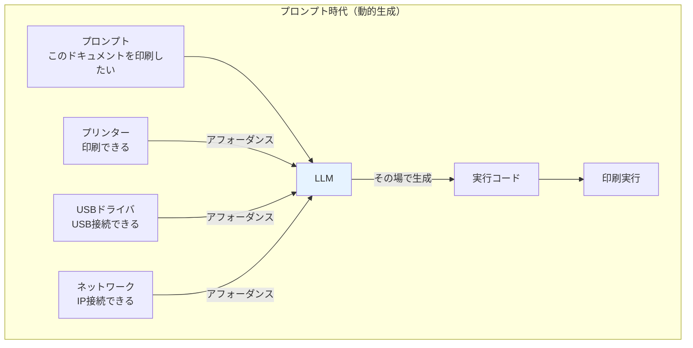

# 第1章詳細：プログラムからプロンプトへ

> 📖 **本編**: この詳細解説は、
> [[How] humanityの設計思想 - 生物学的自己組織化の原理]([How] humanityの設計思想 - 生物学的自己組織化の原理.md)の第1章の補足です。

> ⚠️ **注意：** このページは補足のためにAIが自動生成したページです。編集者である野口岳のチェックは入っていません。悪しからず。

---

## 本ページの目的

「humanityの設計思想」第1章で述べられている「接続の事前定義」という概念の背景にある、**プログラム時代からプロンプト時代への根本的なパラダイム転換**を解説します。

---

## プログラム時代：想定されたことしか動かない

### プログラムとは何か

プログラムは、**事前に定義された手順を機械に実行させる指示書**です。

```python
# プログラムの例
def connect_printer(printer_ip, document):
    driver = load_driver("printer_model_x")
    connection = driver.connect(printer_ip)
    connection.print(document)
```

このコードは、以下を事前に想定しています：

1. プリンターのモデルが「printer_model_x」である
2. ドライバが存在し、読み込める
3. IPアドレスで接続できる
4. `print()`メソッドが存在する

**想定外のことは一切動きません。**

- プリンターのモデルが違ったら？ → エラー
- ドライバがなかったら？ → エラー
- 接続方法がUSBだったら？ → 動かない（事前に定義されていない）

### プログラム時代のシステム設計

プログラム時代、システムを動かすには**全ての接続を事前に設計・実装**する必要がありました。

**例：スマートホームシステム**

```
[照明] ←→ [照明API] ←→ [スマホアプリ]
[エアコン] ←→ [エアコンAPI] ←→ [スマホアプリ]
[冷蔵庫] ←→ [冷蔵庫API] ←→ [スマホアプリ]
```

それぞれのデバイスに対して：
1. 専用のAPIを設計
2. スマホアプリに各APIとの接続コードを実装
3. ユーザーが設定画面で手動で接続

新しいデバイス（電子レンジ）を追加するには：
- メーカーがAPIを公開
- アプリ開発者が電子レンジ用のコードを追加
- アプリを更新

**想定されていないデバイスは、永遠に接続できません。**

### 視覚的理解：プログラム時代の制約



**想定外のデバイスは接続不可能。新デバイスごとにプログラマーが実装を追加する必要がある。**

---

## プロンプト時代：生成的に動く

### プロンプトとは何か

プロンプトは、**目的や意図を自然言語で伝える指示**です。

```
「このドキュメントを印刷したい」
```

この指示には、以下が含まれていません：

- プリンターのモデル
- ドライバの種類
- 接続方法（IP？USB？）
- 実行する具体的なメソッド

しかし、LLM（大規模言語モデル）があれば、この指示から**その場で必要な手順を生成**できます。

### LLMによる動的生成

LLMは、以下の情報を組み合わせて、実行可能な手順を生成します：

1. **目的**：「印刷したい」
2. **環境**：利用可能なプリンター、接続方法、ドライバ
3. **知識**：プリンターの一般的な使い方、類似ケースの経験

**生成される手順の例：**

```python
# LLMが生成したコード（事前には存在しなかった）
available_printer = detect_nearby_printers()[0]
if available_printer.connection_type == "USB":
    connection = usb_connect(available_printer)
elif available_printer.connection_type == "Network":
    connection = network_connect(available_printer.ip)

connection.print(document)
```

**重要なのは、このコードは事前に書かれていなかった**ということです。

### 視覚的理解：プロンプト時代の動的生成



**LLMが環境を認識し、その場で最適な手順を生成。事前の実装は不要。**

---

## パラダイム転換：事前定義 vs 動的生成

|観点|プログラム時代|プロンプト時代|
|---|---|---|
|**動作原理**|事前定義された手順を実行|目的から手順を生成|
|**想定外への対応**|動かない（エラー）|その場で対応を生成|
|**新デバイス追加**|プログラマーがコードを追加|LLMが自動的に認識・接続|
|**設計者の役割**|全てのケースを想定して実装|目的と能力を記述するだけ|

### 具体例：初めて訪れるオフィスでプリンターを使う

**プログラム時代：**
1. プリンターのメーカー・モデルを確認
2. 対応するドライバを探してインストール
3. IPアドレスを設定
4. アプリケーションの印刷設定でプリンターを選択

**プロンプト時代：**
1. 「このドキュメントを印刷したい」と伝える
2. LLMが周囲のプリンターを認識
3. プリンターの能力（「印刷できる」）を読み取る
4. 自動的に接続して印刷

---

## なぜこのパラダイム転換が重要なのか

### 1. 組み合わせ爆発の解消

従来、N個のデバイスを相互接続するには、**N × (N-1) / 2** 通りの接続コードが必要でした。

- 10個のデバイス → 45通りの接続
- 100個のデバイス → 4,950通りの接続

**全てを事前に実装するのは不可能です。**

プロンプト時代では、各デバイスが「できること」を提示するだけで、LLMがその場で最適な組み合わせを生成します。

### 2. 未来のデバイスにも対応可能

プログラム時代には、まだ存在しないデバイスに対応することは不可能でした。新しいデバイスが登場するたびに、プログラマーがコードを追加する必要がありました。

プロンプト時代では、新しいデバイスが「できること」を提示すれば、LLMが自動的に認識し、既存のシステムと接続できます。

---

## 「接続の事前定義」からの解放

第1章で述べられている「接続の事前定義が必要とされる」という問題は、**プログラム時代の制約**でした。

プロンプト + LLM の登場により、この制約から解放される可能性が生まれました。

- ハードウェアとソフトウェアの接続を事前に設計する必要がなくなる
- 人間を「ユーザー」として外部に置く必要がなくなる
- 全てが「できること」を提示するノードとして、動的に接続できる

**これが、humanityプロジェクトの出発点です。**

---

## まとめ

- **プログラム時代**：想定されたことしか動かない。全ての接続を事前に定義する必要がある。
- **プロンプト時代**：目的から手順を生成。その場で動的に接続を作り出せる。
- **パラダイム転換の本質**：「事前定義」から「動的生成」へ。

この理解があって初めて、第2章以降で述べられる「生物システムのような自己組織化」という発想が腹落ちします。

---

[← humanityの設計思想に戻る](humanityの設計思想.md)
