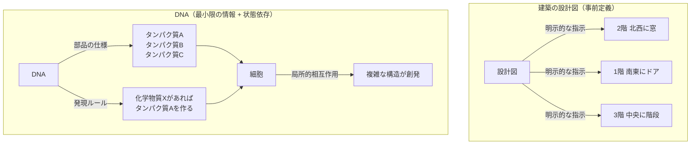
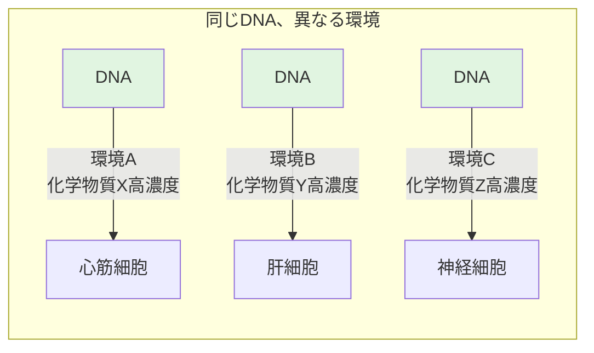
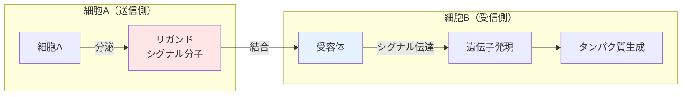
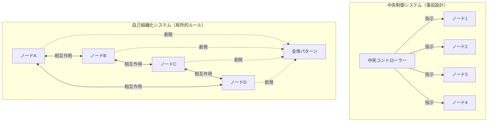

# 第2章詳細：生物学的自己組織化の原理

> 📖 **本編**: この詳細解説は、
> [[How] humanityの設計思想 - 生物学的自己組織化の原理]([How] humanityの設計思想 - 生物学的自己組織化の原理.md)の第2章の補足です。

> ⚠️ **注意：** このページは補足のためにAIが自動生成したページです。編集者である野口岳のチェックは入っていません。悪しからず。

---

## 本ページの目的

「humanityの設計思想」第2章で述べられている生物システムの原理—**DNAは全体設計図を持たない**、**接続は動的に生成される**—を理解するために必要な、分子生物学の基礎知識を解説します。

---

## DNAとは何か：設計図ではなく部品リスト

### 一般的な誤解

「DNAは生物の設計図である」と言われることがありますが、これは正確ではありません。

設計図とは、建築図面のように「どこに何をどう配置するか」が詳細に記述されたものです。しかし、DNAにはそのような情報は含まれていません。

### DNAが記述しているもの

DNAが記述しているのは、主に以下の2つです：

1. **タンパク質の構造情報**（アミノ酸の配列）
2. **遺伝子発現の調節情報**（どの遺伝子をいつ・どこで発現させるか）

**建築に例えるなら：**

- ❌ 設計図：「2階の北西の角に窓を設置せよ」
- ✅ DNAが記述すること：「窓という部品はこういう構造」「外壁が日光を感知したら窓を作れ」

つまり、**部品の仕様と、状態に応じた発現ルール**だけが記述されています。

### 視覚的理解：設計図 vs DNA

**重要な違い：**
- **設計図**: 全体像が明示的に記述されている
- **DNA**: 部品と条件だけ。全体構造は相互作用から創発

---

## 遺伝子発現：状態に応じて動的に決まる

### 同じDNA、異なる細胞

人間の体には約37兆個の細胞がありますが、**全ての細胞が同じDNAを持っています**。

しかし：
- 心臓の細胞は心筋細胞として機能する
- 肝臓の細胞は肝細胞として機能する
- 神経の細胞はニューロンとして機能する

なぜ同じDNAから異なる細胞が生まれるのか？

### 遺伝子発現の制御メカニズム

**遺伝子発現**とは、DNAに記述された遺伝子情報をもとにタンパク質が作られる過程です。

この発現は、**状態依存的**に制御されます：

1. **場所（組織の種類）**
   - 心臓の領域では心筋関連の遺伝子が発現
   - 肝臓の領域では肝臓関連の遺伝子が発現

2. **化学シグナル（周囲の環境）**
   - 特定の化学物質（成長因子、ホルモンなど）が存在すると、特定の遺伝子が発現する
   - 周囲の細胞が発するシグナル分子に応じて、発現する遺伝子が変わる

3. **時間（発生段階）**
   - 胎児期には発生に関わる遺伝子が発現
   - 成人期には維持に関わる遺伝子が発現

### 具体例：胚発生

受精卵（1つの細胞）から、人間（37兆個の細胞）が形成される過程を考えてみましょう。

1. **最初の細胞分裂**
   - 受精卵が2つに分裂
   - この時点では、まだどちらも「全能性」を持つ（どんな細胞にもなれる）

2. **位置情報の生成**
   - 細胞が増えていくと、「自分がどこにいるか」という位置情報が生まれる
   - これは、濃度勾配を持つ化学物質（モルフォゲン）によって作られる
   - 例：「この化学物質の濃度が高い = 頭側」「低い = 尾側」

3. **位置に応じた遺伝子発現**
   - 頭側の細胞は「脳を作る遺伝子」を発現
   - 尾側の細胞は「脊髄を作る遺伝子」を発現

4. **細胞間相互作用による精緻化**
   - 隣接する細胞同士がシグナルをやり取り
   - 「君が神経細胞になるなら、私はサポート細胞（グリア細胞）になる」

**重要なのは、「心臓はここに作れ」という指示がDNAに書かれているわけではない**ということです。

### 視覚的理解：状態依存的な遺伝子発現

**同じDNAが、周囲の状態（化学物質の種類・濃度）に応じて、異なる遺伝子を発現する。**

---

## 細胞間コミュニケーション：受容体とリガンド

### 細胞はどうやって「繋がる」のか

細胞と細胞が接続・協調するには、情報をやり取りする仕組みが必要です。

生物システムでは、**受容体（receptor）** と **リガンド（ligand）** という分子の組み合わせで、細胞間コミュニケーションが実現されています。

### 受容体とリガンドの仕組み

**リガンド（送信側）**
- 細胞が分泌する化学物質（シグナル分子）
- 「私はこういう情報を持っています」というメッセージ

**受容体（受信側）**
- 細胞膜に存在するタンパク質
- 特定のリガンドと結合する「鍵穴」のような構造

**例：神経伝達**
1. 神経細胞Aが神経伝達物質（リガンド）を放出
2. 隣の神経細胞Bの受容体がそれをキャッチ
3. 細胞B内でシグナルが伝わり、特定の遺伝子が発現する

### 視覚的理解：受容体とリガンド

**鍵と鍵穴のような関係：**
- リガンド（鍵）は特定の受容体（鍵穴）にのみ結合
- 結合すると、細胞内でシグナルが伝わる
- 結果として、特定の遺伝子が発現する

### 動的な接続生成

重要なのは、**接続が事前に固定されていない**ことです。

- 受容体は、必要に応じて生成・配置される
- リガンドも、状態に応じて分泌される
- 「細胞Aと細胞Bをこの形で繋げ」という設計図はない

**例：免疫系**
- 病原体が侵入すると、免疫細胞が活性化
- 活性化した免疫細胞は、特定のリガンド（サイトカイン）を分泌
- 周囲の細胞がそのリガンドを受容し、適切な応答を開始
- この接続パターンは、病原体の種類や状態によって毎回異なる

---

## 自己組織化：全体設計図なしに構造が生まれる

### 自己組織化とは

**自己組織化（self-organization）**とは、局所的な相互作用から、全体としての秩序や構造が自発的に生まれる現象です。

**特徴：**
- 中央制御なし
- 全体設計図なし
- 局所的なルールだけ

### 視覚的理解：中央制御 vs 自己組織化

### 生物における自己組織化の例

**1. 血管網の形成**

血管がどう配置されるかは、DNAに書かれていません。

- 組織が酸素不足になると、血管成長因子（VEGF）を分泌
- 近くの血管細胞がそれを感知し、その方向に伸びる
- 伸びた血管が酸素を供給すると、VEGFの分泌が減る
- 結果として、必要な場所に必要な密度で血管網が形成される

**2. 腸の絨毛（じゅうもう）の形成**

腸の内壁には、無数の突起（絨毛）があります。これも設計図なしに形成されます。

- 細胞が増殖すると、物理的な圧力が生まれる
- 圧力が高い場所で細胞の配置が変わる
- シグナル分子の濃度勾配が生まれる
- 結果として、規則的な絨毛構造が創発する

### 創発（emergence）

**創発**とは、部分の相互作用から、部分の性質だけでは予測できない全体の性質が生まれることです。

- 水分子（H₂O）には「濡れる」という性質はない
- しかし大量の水分子が集まると「液体」という性質が創発する
- 神経細胞1つには「意識」はない
- しかし数百億個の神経細胞のネットワークから「意識」が創発する

生物システムでは、DNAに記述された最小限のルールから、複雑な構造・機能が創発します。

---

## まとめ：生物システムの4つの原理

第2章で述べられている生物システムの原理を、改めて整理します：

### 1. 全体設計図を持たず、最小限の情報のみを記述する

DNAは「心臓をここに作れ」とは書いていない。部品（タンパク質）の仕様と、状態に応じた発現ルールだけを記述している。

### 2. 各ノード（細胞）は、自分ができることを提示する

細胞は、リガンド（シグナル分子）を分泌することで、「私はこういう能力を持っている」と周囲に提示する。

### 3. 接続は、相手に応じて動的に生成される

受容体とリガンドの組み合わせにより、状態に応じて接続が形成される。事前に「細胞Aと細胞Bを繋げ」という設計はない。

### 4. 全体構造は、局所的な相互作用から創発する

心臓の形、血管の配置、脳の構造。これらは全て、細胞間の局所的な相互作用の積み重ねから自己組織化する。

---

## humanityプロジェクトへの応用

この生物学的原理を、ハードウェア・ソフトウェア・人間からなる人工システムに適用すれば：

1. **全体設計図なし** → システム全体を事前に設計する必要がない
2. **能力の提示** → 各ノードがアフォーダンス（「できること」）を提示
3. **動的接続** → LLMが状態に応じて接続を生成
4. **創発** → 予想外の有用な組み合わせが生まれる

**これがhumanityプロジェクトの核心的アイデアです。**

---

[← humanityの設計思想に戻る](humanityの設計思想.md)
