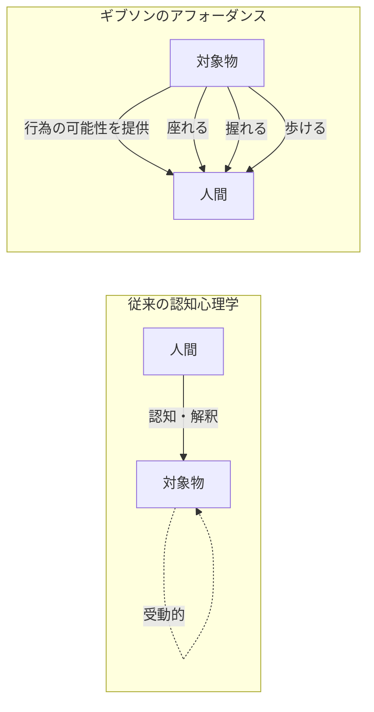
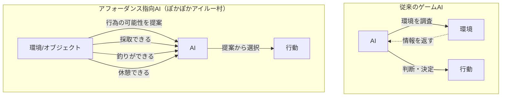
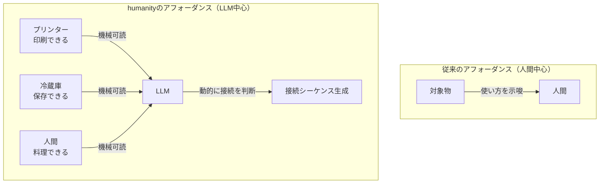

# 第3-4章詳細：アフォーダンス理論の背景

> 📖 **本編**: この詳細解説は、
> [[How] humanityの設計思想 - 生物学的自己組織化の原理]([How] humanityの設計思想 - 生物学的自己組織化の原理.md)の第3-4章の補足です。

> ⚠️ **注意：** このページは補足のためにAIが自動生成したページです。編集者である野口岳のチェックは入っていません。悪しからず。

---

## 本ページの目的

「humanityの設計思想」第3-4章で中心的に用いられる**アフォーダンス**という概念の本来の意味と、humanityプロジェクトにおける独自解釈を解説します。

---

## アフォーダンスとは何か：ギブソンの生態学的アプローチ

### 提唱者：ジェームズ・ギブソン

**アフォーダンス（affordance）**という概念は、心理学者ジェームズ・J・ギブソン（James J. Gibson）が1979年に提唱しました。

ギブソンは、従来の知覚心理学が「脳の中で情報処理が起きる」と考えていたのに対し、**「知覚は環境との相互作用の中で直接起きる」**という立場を取りました。これを**生態学的アプローチ（ecological approach）**と呼びます。

### アフォーダンスの定義

アフォーダンスとは、**環境が動物に対して提供する「行為の可能性」**です。

**例：**
- 平らな地面は「歩く」というアフォーダンスを提供する
- 椅子は「座る」というアフォーダンスを提供する
- 取っ手は「握る」「引く」というアフォーダンスを提供する

重要なのは、**アフォーダンスは主観的な解釈ではなく、環境と動物の関係性の中に客観的に存在する**とギブソンが考えた点です。

### 動物との関係性

アフォーダンスは、動物の能力や身体特性によって変わります。

- 人間にとって椅子は「座れる」が、アリにとっては「登れる」
- 人間にとって川は「渡れない」が、カエルにとっては「泳げる」

つまり、**アフォーダンスは対象の物理的性質と、それを知覚する動物の能力の両方で決まる**のです。

### 視覚的理解：従来の認知 vs アフォーダンス



**重要な転換：**
- **従来**: 人間が対象を認知し、「これは椅子だ」と解釈してから「座れる」と判断
- **アフォーダンス**: 対象が直接「座れる」という可能性を提供し、人間はそれを直接知覚

---

## シグニファイア：ドナルド・ノーマンによる拡張

### アフォーダンスとシグニファイアの違い

デザイン分野では、ドナルド・ノーマン（Donald Norman）がアフォーダンスの概念をデザインに応用しました。

ノーマンは、アフォーダンスを2つに分けました：

**1. アフォーダンス（本来の意味）**
- 対象が実際に持っている行為の可能性
- 例：ドアは「押す」「引く」ことができる（物理的事実）

**2. シグニファイア（signifier）**
- 「どう使うべきか」を示す手がかり
- 例：ドアの取っ手の形状（「引く」ことを示唆）、「押」という文字（「押す」ことを明示）

**なぜ区別が必要か？**

ギブソンのアフォーダンスは「客観的に存在する可能性」でしたが、デザインでは**「ユーザーにどう伝えるか」**が重要です。

- ドアは「押す」「引く」両方のアフォーダンスを持つ
- しかし、取っ手の形状（シグニファイア）によって、「引くべき」と伝える

### デザインにおける「動詞が訴えかける」

良いデザインとは、**シグニファイアが明確で、対象の使い方が直感的にわかる**デザインです。

**例：**
- ボタンは「押したくなる」形状（凸型、押せそうな質感）
- スライダーは「動かしたくなる」形状（つまみ、レール）
- テキストボックスは「入力できる」ことを示す（枠、カーソル点滅）

これを「**動詞が訴えかける**」と表現します。対象が「私を押して」「私を引いて」と語りかけてくるようなデザインです。

---

## ゲーム開発におけるアフォーダンスの活用

### 事例：モンスターハンター「ぽかぽかアイルー村」（CEDEC 2011）

ゲーム業界では、アフォーダンスの概念を積極的に活用した事例があります。

**CEDEC 2011で発表された「ぽかぽかアイルー村」のアフォーダンス指向AI**では、従来の「AIが環境を調べて行動を決定する」アプローチではなく、**「環境自体がAIに行為を提案する」**という革新的な設計が採用されました。

#### 従来のゲームAI vs アフォーダンス指向AI



#### システムの仕組み

1. **提案テーブル**：各アイルー（キャラクター）の性格を表現
2. **アフォーダンステーブル**：アイテムやモンスターが持つ「選択肢」と「影響値」
3. **組み合わせ**：両者を組み合わせて最も高い値のものをプレイヤーに提案

**結果：**
- AIに個性が生まれ、ユーザーを飽きさせない
- 文脈に応じた適切な提案
- ゲーム進行をストレスなくコントロール

### レベルデザインにおけるアフォーダンス

現代のゲームデザインでは、アフォーダンスは**レベルデザイン**（環境設計）において重要な概念として定着しています。

**例：**
- **ボタンのようなUI** → 「押す」という行為を示唆
- **ひび割れた壁** → 「壊せる」という行為を示唆
- **トゲのある敵** → 「踏みたくない」という回避行動を示唆

プレイヤーに明示的な指示を出さなくても、**環境そのものが「何ができるか」を伝える**デザインです。

---

## humanityプロジェクトにおける独自解釈

### 本来の意味との違い

ギブソンとノーマンのアフォーダンスは、**人間中心**の概念でした。

- ギブソン：動物（主に人間）が環境をどう知覚するか
- ノーマン：ユーザーに対象の使い方をどう伝えるか

しかし、humanityプロジェクトでは、**対象自身が持つ能力**として再定義しています。

### humanityにおけるアフォーダンスの定義

**アフォーダンス = 各ノード（ハードウェア・ソフトウェア・人間）が持つ能力を、動詞として記述したもの**

**特徴：**

1. **人間中心ではない**
   - 「人間にとって使えるか」ではなく、「対象が何をできるか」

2. **動詞として記述**
   - 「印刷できる」「加熱できる」「保存できる」

3. **ハードウェア・ソフトウェア・人間を区別しない**
   - プリンター：「印刷できる」
   - アプリ：「計算できる」
   - 人間：「料理できる」
   - 全て同じ形式で記述される

4. **機械可読**
   - YAML/JSON形式で記述され、LLMが読み取れる

### なぜこの再定義が必要だったのか

従来のアフォーダンス概念は、**人間が対象を知覚・使用する**という前提でした。

しかし、LLMが登場した今、**LLMが対象の能力を読み取り、動的に接続を判断する**ことが可能になりました。

そのためには：
- 対象が「何ができるか」を機械可読な形式で提示する必要がある
- 人間・ハードウェア・ソフトウェアを区別せず、同じ方法で記述する必要がある

### 視覚的理解：humanityにおけるアフォーダンス



**重要な転換：**
- **従来**: 人間が対象のアフォーダンスを知覚
- **humanity**: LLMが全てのノード（ハードウェア・ソフトウェア・人間）のアフォーダンスを読み取り、動的に接続

---

## 具体例：アフォーダンスの記述

### プリンター

```yaml
node_id: "printer_A"
capabilities:
  - action: "print"
    parameters:
      - name: "document"
        type: "file"
      - name: "color"
        type: "boolean"
```

このプリンターは「印刷できる」というアフォーダンスを提示しています。

### 冷蔵庫

```yaml
node_id: "refrigerator_B"
capabilities:
  - action: "store"
    parameters:
      - name: "item"
        type: "food"
  - action: "measure_temperature"
    returns: "number"
```

この冷蔵庫は「保存できる」「温度を計測できる」という2つのアフォーダンスを提示しています。

### 人間

```yaml
node_id: "human_tanaka"
capabilities:
  - action: "cook"
    skills: ["curry", "pasta"]
  - action: "judge"
    domains: ["business", "technology"]
```

人間も同じ形式で記述されます。「料理できる」「判断できる」というアフォーダンスです。

### 重要なポイント

これらの記述において、**プリンター・冷蔵庫・人間という分類は重要ではありません**。

重要なのは：
- 「何ができるか（動詞）」
- 「どういうパラメータが必要か」

LLMはこの情報を読み取り、目的に応じて適切な組み合わせを判断します。

---

## カテゴリー分類からの解放

### 従来のシステム設計

従来、システムを設計する際には、対象を分類することから始めました：

- **ハードウェア**：物理的に存在するもの。ドライバが必要。
- **ソフトウェア**：デジタル空間に存在するもの。APIで接続。
- **ユーザー（人間）**：システムの外側に存在。入力を与え、出力を受け取る。

この分類が、システムを複雑にしていました。

### アフォーダンスによる統一

アフォーダンスを用いれば、全てのノードを統一的に扱えます：

|対象|従来の分類|アフォーダンス（「できること」）|
|---|---|---|
|プリンター|ハードウェア|「印刷できる」|
|画像編集アプリ|ソフトウェア|「画像を編集できる」|
|人間|ユーザー|「料理できる」「判断できる」|

**「何であるか（名詞・カテゴリー）」ではなく、「何ができるか（動詞）」** に着目することで、事前に分類・設計する必要がなくなります。

---

## まとめ

### ギブソンのアフォーダンス
- 環境が動物に提供する「行為の可能性」
- 知覚は環境との直接的な相互作用で起きる

### ノーマンのシグニファイア
- 「どう使うべきか」を示す手がかり
- デザインにおいて、ユーザーに使い方を伝える重要性

### humanityにおけるアフォーダンス
- **対象自身が持つ能力を、動詞として記述**
- 人間中心ではなく、機械可読な形式
- ハードウェア・ソフトウェア・人間を区別しない
- LLMが読み取り、動的に接続を判断する基盤

---

## なぜ「アフォーダンス」という言葉を使うのか

本来の定義とは異なる使い方をしているのに、なぜ「アフォーダンス」という言葉を使うのか？

それは、**「対象が提供する行為の可能性」という本質は同じ**だからです。

- ギブソン：対象が人間に提供する行為の可能性
- humanity：対象がシステムに提供する行為の可能性

人間が対象を知覚するように、LLMが対象の能力を読み取る。この類似性から、「アフォーダンス」という言葉が適していると考えています。

---

[← humanityの設計思想に戻る](humanityの設計思想.md)
