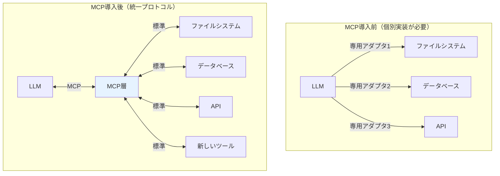
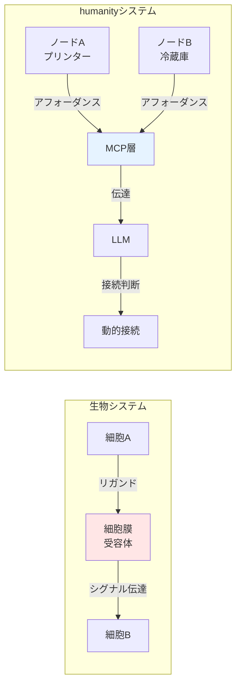

# 第5章詳細：MCPの役割と設計思想

> 📖 **本編**: この詳細解説は、
> [[How] humanityの設計思想 - 生物学的自己組織化の原理]([How] humanityの設計思想 - 生物学的自己組織化の原理.md)の第5章の補足です。

> ⚠️ **注意：** このページは補足のためにAIが自動生成したページです。編集者である野口岳のチェックは入っていません。悪しからず。

---

## 本ページの目的

「humanityの設計思想」第5章で述べられる**MCP（Model Context Protocol）**について、一般的な定義と、humanityプロジェクトにおける位置づけを解説します。

---

## MCP（Model Context Protocol）とは何か

### 開発元：Anthropic

MCPは、Anthropic社（Claude AIの開発元）が2024年に公開した、**LLMとツール間の接続を標準化するための通信プロトコル**です。

公式サイト：https://modelcontextprotocol.io/

### MCPが解決しようとしている問題

LLMが外部ツールと連携する際、これまでは各ツールごとに独自の接続方法を実装する必要がありました。

**例：LLMがファイルシステム、データベース、APIと連携する場合**

```
[LLM] ←→ [ファイルシステム用アダプタ]
      ←→ [データベース用アダプタ]
      ←→ [API用アダプタ]
```

それぞれ異なる接続方法、データ形式、エラー処理が必要で、開発コストが高くなっていました。

### MCPの役割：標準化された接続層

MCPは、**共通のプロトコル**を提供することで、LLMと任意のツールを統一的に接続できるようにします。

```
[LLM] ←→ [MCP] ←→ [ファイルシステム]
                ←→ [データベース]
                ←→ [API]
                ←→ [任意のツール]
```

各ツールは、MCPに準拠したインターフェースを提供するだけで、LLMと接続できます。

### 視覚的理解：MCP導入前 vs 導入後



**MCPによる標準化で、新しいツールの追加が容易になる。**

---

## MCPの技術仕様

### JSON-RPCベース

MCPは、**JSON-RPC 2.0**という標準的な通信プロトコルをベースにしています。

**JSON-RPC**とは：
- リモートプロシージャコール（RPC）の一種
- JSON形式でメッセージをやり取り
- メソッド呼び出し、パラメータ、レスポンスを標準化

**例：ツールの呼び出し**

```json
{
  "jsonrpc": "2.0",
  "method": "tools/call",
  "params": {
    "name": "print",
    "arguments": {
      "document": "report.pdf",
      "color": true
    }
  },
  "id": 1
}
```

LLMがツールを呼び出す際、このような標準化されたメッセージを送ります。

### MCPが提供する機能

MCPは、以下の3つの主要機能を提供します：

1. **リソース（Resources）**
   - ツールが提供するデータや情報
   - 例：ファイルの内容、データベースのレコード

2. **プロンプト（Prompts）**
   - 事前定義されたプロンプトテンプレート
   - 例：「このファイルを要約して」

3. **ツール（Tools）**
   - ツールが実行できる操作
   - 例：「ファイルを読む」「データベースに書き込む」

---

## 一般的なMCPの用途

Anthropicが想定している主な用途は、**LLMがローカル環境や企業システムと連携すること**です。

### 例1：ローカルファイルシステムとの連携

Claude（LLM）がユーザーのパソコン上のファイルを読み書きする。

- ユーザー：「昨日作成した report.docx を要約して」
- Claude：MCPを通じてローカルファイルシステムにアクセス
- ファイルを読み取り、要約を生成

### 例2：企業データベースとの連携

Claude が企業の顧客データベースにアクセスし、レポートを生成する。

- ユーザー：「先月の売上トップ10の顧客をリストアップして」
- Claude：MCPを通じてデータベースにクエリを送信
- 結果を受け取り、整形して提示

### 例3：複数ツールの組み合わせ

Claude が複数のツールを連携させて複雑なタスクを実行する。

- ユーザー：「営業レポートを作成して、Slackで共有して」
- Claude：
  1. MCPでCRMシステムからデータ取得
  2. MCPでスプレッドシートに整形
  3. MCPでSlackに投稿

---

## humanityプロジェクトにおけるMCPの位置づけ

### 一般的な用途との違い

Anthropicの想定する用途は、**LLMがツール（デジタル）と連携する**ことでした。

しかし、humanityプロジェクトでは、**ハードウェア・ソフトウェア・人間を区別せず、全てをノードとして接続する**ために使います。

### 生物学的対応：細胞膜

humanityプロジェクトでは、MCPを**生物学における細胞膜**に対応するものとして捉えています。

**細胞膜の役割：**
- 細胞と細胞の間でシグナル分子（リガンド）をやり取り
- 受容体がリガンドを受け取り、細胞内にシグナルを伝達
- 細胞間の接続を可能にする

**MCPの役割（humanityにおける解釈）：**
- ノードとノードの間でアフォーダンス（能力情報）をやり取り
- LLMがアフォーダンスを読み取り、接続判断を行う
- ノード間の動的接続を可能にする

### 視覚的理解：生物学の細胞膜 vs humanityのMCP



### MCPは「伝達の仕組み」であって「判断の仕組み」ではない

**これが最も重要なポイントです。**

MCPができること：
- ノードAが「印刷できる」という情報を伝える
- ノードBが「加熱できる」という情報を伝える
- LLMからノードへの命令を伝える

MCPができないこと：
- 「どのノードとどのノードを繋げるべきか」を判断する
- 「この目的にはどのノードが適切か」を決定する

**判断を行うのはLLMです。**

---

## 3つの要素の相互作用

humanityプロジェクトにおける自己組織化システムは、3つの要素の組み合わせで実現されます：

### 1. アフォーダンス：能力の記述

各ノード（ハードウェア・ソフトウェア・人間）が、YAML/JSON形式で「自分ができること」を記述する。

**対応：DNA（最小限の情報）**

### 2. MCP：伝達層

アフォーダンスを読み取り、ノード間で伝達する共通プロトコル。

**対応：細胞膜（受容体とリガンド）**

### 3. LLM：判断機構

目的と環境（利用可能なアフォーダンス）から、どのノードをどう組み合わせるかを動的に判断する。

**対応：遺伝子発現制御（状態に応じた判断）**

---

## 具体例：カレーを作る

### ノードのアフォーダンス

**冷蔵庫（MCP経由で提示）：**
```yaml
capabilities:
  - action: "list_contents"
  - action: "measure_temperature"
```

**電子レンジ（MCP経由で提示）：**
```yaml
capabilities:
  - action: "heat"
    parameters:
      - name: "duration"
      - name: "power"
```

**人間（MCP経由で提示）：**
```yaml
capabilities:
  - action: "cook"
    skills: ["curry", "pasta"]
```

### プロンプト（目的）

「カレーを作りたい」

### MCPの役割

1. 冷蔵庫のアフォーダンスをLLMに伝える
2. 電子レンジのアフォーダンスをLLMに伝える
3. 人間のアフォーダンスをLLMに伝える

### LLMの判断

受け取ったアフォーダンスと目的から、接続シーケンスを生成：

```
1. 冷蔵庫.list_contents() → 材料を確認
2. 電子レンジ.heat(duration=5, power="high") → 材料を加熱
3. 人間.cook(recipe="curry") → 調理を依頼
```

### MCPの実行

LLMが生成した接続シーケンスを、MCP経由で各ノードに送信・実行する。

---

## MCPの制約と重要性

### 制約：判断しない

MCPは、「冷蔵庫と電子レンジを組み合わせればカレーができる」とは判断しません。

これは一見、制約に見えますが、実は**設計思想として重要**です。

### なぜ判断を分離するのか

もしMCPが判断機能を持っていたら：
- MCPに複雑なロジックを実装する必要がある
- 新しいノードが追加されるたびに、MCPを更新する必要がある
- システム全体が硬直化する

**判断をLLMに任せることで：**
- MCPはシンプルな伝達層に徹する
- LLMが柔軟に判断できる
- 新しいノードが追加されても、MCPの変更は不要

これは、生物システムにおいて「細胞膜は伝達するだけ、判断は遺伝子発現制御が行う」という分離と同じ原理です。

---

## まとめ

### 一般的なMCP
- Anthropic社が開発したLLMとツール間の標準プロトコル
- JSON-RPCベース
- ローカル環境や企業システムとLLMを連携させることが主な用途

### humanityにおけるMCP
- **生物学の「細胞膜」に相当する伝達層**
- ハードウェア・ソフトウェア・人間のアフォーダンスを伝達
- **判断はしない**（判断はLLMが行う）
- アフォーダンス + MCP + LLM の3要素で自己組織化を実現

### なぜMCPが重要なのか

MCPがなければ、各ノードは独自の接続方法を持つことになり、「事前定義」の世界に戻ってしまいます。

MCPという共通プロトコルがあるからこそ、**事前に接続を設計しなくても、動的に接続が生成される**システムが実現できるのです。

---

[← humanityの設計思想に戻る](humanityの設計思想.md)
